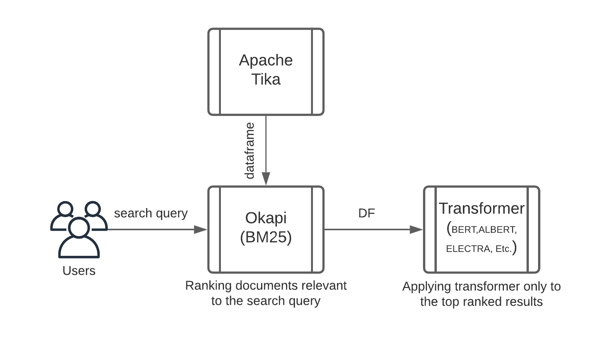
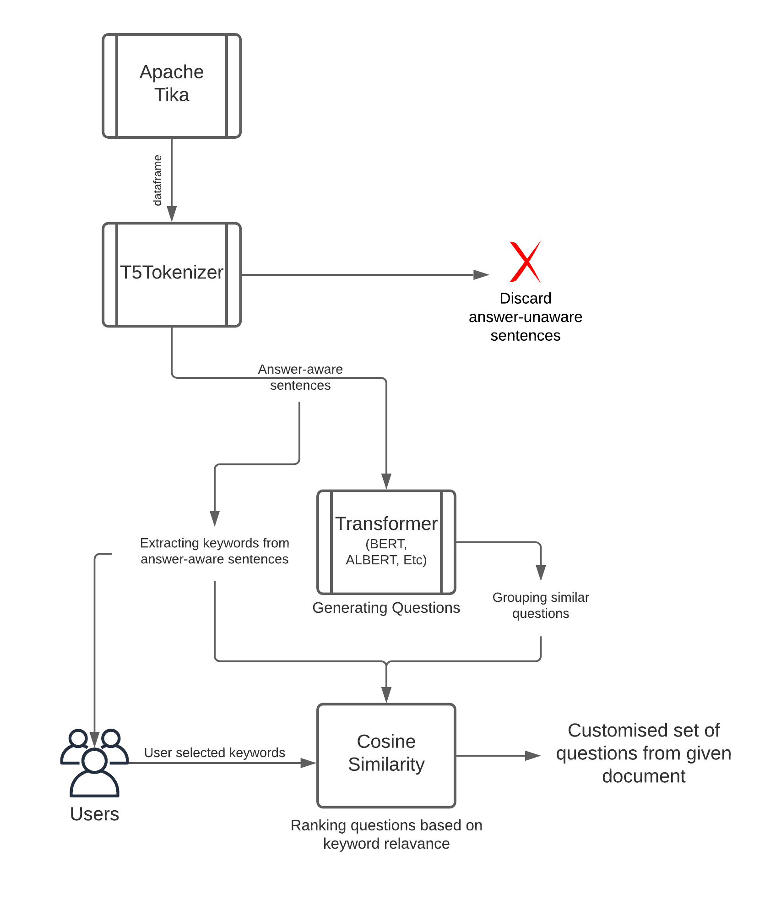

# BETCHES, A Virtual Assistant🤖


- [Project Details](#project-details)
- [Project Architecture](#project-architecture)
- [Features](#features)
  - [Closed Domain Question Answering](#closed-domain-question-answering)
  - [Closed Domain Question Generation](#closed-domain-question-generation)
- [Results](#results)
- [Requirements](#requirements)
- [Usage](#usage)
- [Team Members](#team-members)


## Project Details


Question Generation and Answering, being a challenging task, has gained considerable attention in the past years. Even though significant milestones are achieved, when used in a real-time system, it needs indispensable optimization. This paper proposes an approach to developing an online platform that facilitates traditional processes by introducing a virtual assistant to support educational programs by asking questions in natural language and getting an answer without reading the internal documents relevant to the problem. The system put forward is a cloud-based solution that automatically generates questions and provides sample answers from a given document(s). The entire architecture integrated into the WhatsApp interface with Twilio API's help offers a user-friendly experience.

Keywords—Question Generation, Question Answering, Twilio, Okapi, RankBM25 models, Apache Tika, T5Tokenizer.


## Project Architecture

To provide high speed, automatic software integration, back-ups, mobility, Etc., The proposed system is a cloud-based solution. DigitalOcean, an Infrastructure as a service (IaaS) provider, is used. 

General users using the system interact with a chatbot having a WhatsApp Interface. The chatbot is integrated with a Google-owned framework, DialogFlow, with a trained intent to help the users interact in a natural language. Every text entered by the user is forwarded to the web server via Twilio API services. Twilio API acts as a mediator between the WhatsApp Interface and Q.A. /Q.G. APIs that can handle texts, images, pdfs, docs, and many more. The proposed system also supports the multi-user aspect.

<p align="center">
  
</p>

**A Detailed report of this project can be found [HERE](https://github.com/itslasagne/betches/blob/main/frontend/src/components/landing/images/BE_Research_Paper.pdf)**

## Features

An efficient cloud-based system capable of providing support and assistance to the teaching faculty and students. The highlighting features would be : 

<ul>
  <li>Answering almost any question from a Closed domain.</li>
  <li>Given a context and a domain(s), the assistant generates relevant questions.</li>
  <li>Efficient Document(s) Summarization</li><li>Given a context and a domain(s), the assistant can generate a question bank.</li>
  <li>Open Domain Question Answering based on Wikipedia knowledge.</li>
</ul>

## Closed Domain Question Answering

The architecture employed here is an efficient way of preprocessing the raw data before passing it to the Q.A. model, where the input data can be of any form (pdf, word, docs, images, txt, ppt, Xls, Etc.), but the goal remains the same, i.e., to work efficiently with almost any kind of data received from the user.

Almost every Q.A. architecture based on transformers follows the same pipeline of breaking down the input text into paragraphs and tokenizing it. Further removes the stop words and then performs basic N.L.P. tasks (like lemmatization and stemming) and passes them to the transformer.

Given a document, assuming that not every sentence or paragraph is relevant to the query, not all metadata needs to follow the Q.A. pipeline. With the help of a probabilistic relevance model, the document can be filtered and eliminate a majority of the text by ranking texts/documents based on the relevance with a given search query. The Okapi(BM25), a weighting scheme framework, the best-known derivative of the probabilistic relevance model, can rank the text and efficiently query only the informative and relevant text.

The given architecture can be built on top of any existing Q.A. models to increase its efficiency.

<p align="center">
  
</p>


## Closed Domain Question Generation

Many attempts to generate a question from a given context have been made, but due to the prior models' complexity, it is not considered a mainstream task as Q.A. The straightforward Q.G. pipeline our system puts forth would be

<ul>
  <li>Handling long text</li>
  <li>T5 Tokenizer</li>
  <li>Generating Question</li>
  <li>Grouping similar questions</li>
  <li>Question Selection</li>
</ul>

<p align="center">
  
</p>


## Results

We have used S.Q.U.A.D. 2.0 dataset for training the Question Generation as well as Question Answering models. Table 1 and 2 shows the time comparisons of Q.A. and Q.G. models on various paragraphs of text. The results given in the table are the average of consistent and consecutive outputs.

                                                 Table 1: Results of Question Answering Models
| Q.A. Models | Time taken (base model)(< 1000 words) | Time taken (base model)(> 1000 words) | Time taken (base model + proposed algorithm)(>1000 words) | Accuracy(EM) |
|----------------------------------------------------------------------------|---------|---------|---------|--------|
| [ALBERT (single model)]() | 14.267 sec | StackOverFlow Error | ( 14.267 + rank_bm ) sec | 88.592 |
| [ELECTRA]() | 7.363 sec | StackOverFlow Error | ( 7.363 + rank_bm ) sec | 88.716  |
| [ROBERTA (single model)]() | 9.712 sec | StackOverFlow Error | ( 9.712 + rank_bm ) sec | 86.820 |

In Table 1, for the base model + proposed algorithm section,  rank_bm is the time taken by OkApi's algorithm for text selection. Here, rank_bm can have variable values depending on the page size and the context it holds. If the context has less than 1000 words, then no preprocessing is done, and the text is directly fed to the base model. Hence, the resultant speed of the proposed model equals the speed taken by the base model (per 1000 words, worst case) plus the time taken by the bm25 models. Hence,

``` 
Total Time Taken = Base1000 + TBM25 seconds 
where,
Base1000=  Time taken by the base model for 1000 words
TBM25= Time taken by the Rank BM25 models 
```

                                                 Table 2: Results of Question Generation Models
| Q.G. Models | Time Taken (less than 1000 words) | Time Taken (more than 1000 words) |
|----------------------------------------------------------------------------|---------|---------|
| [Squash question generation)]() | 0.941 sec | StackOverFlow Error |
| [Proposed model]() | 0.826 sec | 0.826*(No. of words/1000) sec (approx.) |

In Table 2, the average time taken for every 1000 words is 0.826 seconds (Approx.) for the proposed model. However, if the word limit of the context exceeds 1000 words, to avoid the StackOverFlow Error, the context is broken down so that the model receives input in batches of the text of 1000 words max. In such a case, the time taken can be variable, and it can be deduced as the time taken by the model for 1000 words, times the number of batches of 1000. Hence,

```
Total Time Taken = T1000* ( Number of words / 1000 ) seconds
where,
T1000 = Time taken to process 1000 words
```

The Question-answering model follows a decent step-by-step approach, achieving state-of-the-art performance on sentence-level, paragraph-level, and also document-level contexts. Our algorithm speeds up the process to get the output in the minimum time possible and provides a strong base for further research.


## Requirements
```
bs4
tika
nltk
rank_bm25
transformers
nltk.downloader punkt
```

## Usage

[](https://colab.research.google.com/drive/14u06HthxhdhPSyXSTNFxZxwcWd_Wi4XO?usp=sharing)

#### Closed Domain Question Answering

This feature can take inputs in two forms:

  1. `context as text` - context and question are provided and answer in generated

```python3

context = "Question answering (QA) is a challenging task and has received considerable attention in the last years since it has assumed a central role in the next generation of both digital assistants, like Siri, Google Assistant, Alexa, and Cortana, as well as of cognitive systems like Watson [1]. QA systems have been actively studied to automatically answer with either short facts or long passages to natural language questions issued by users in different languages, in contrast to search engines, able to return a collection of related documents given some keywords. Even though there are many variations in the proposed QA systems [2-4], typical QA systems adopt a pipeline architecture that incorporates three major phases: (1) question processing; (2) information retrieval; (3) answer selection" 
question = 'what are the phases of QA Architecture?'

from cdqa_adv import CDQA_adv

cdqa = CDQA_adv()
answer = cdqa.generate_answer(context,question)
print(answer)

=> {'Answer': '(1) question processing; (2) information retrieval; (3) answer selection',
 'Answer_Paragraph': 'Question answering (QA) is a challenging task and has received considerable attention in the last years since it has assumed a central role in the next generation of both digital assistants, like Siri, Google Assistant, Alexa, and Cortana, as well as of cognitive systems like Watson [1]. QA systems have been actively studied to automatically answer with either short facts or long passages to natural language questions issued by users in different languages, in contrast to search engines, able to return a collection of related documents given some keywords. Even though there are many variations in the proposed QA systems [2-4], typical QA systems adopt a pipeline architecture that incorporates three major phases: (1) question processing; (2) information retrieval; (3) answer selection',
 'Paragraph_Numbers': '1',
 'Question': 'what are the phases of QA Architecture?'}
```


  2. `multiple documents` - wherein the relative path to the folder containing the docs is given
 
```python3

# Directory Structure
└───pdf_data
  └───Research_paper_3.pdf
  └───Research_paper_4.pdf
  └───Research_paper_5.pdf
---------------------------------------------------------------------------------------

from cdqa_adv import CDQA_adv

cdqa = CDQA_adv()
answer = cdqa.doc_generate_answer(directory_path='pdf_data', question= 'what are the phases of QA Architecture?')
print(answer)

=> {'Answer': '(1) question processing; (2) information retrieval; (3) answer selection',
 'Answer_Paragraph': 'Question answering (QA) is a challenging task and has received considerable attention in the last years since it has assumed a central role in the next generation of both digital assistants, like Siri, Google Assistant, Alexa, and Cortana, as well as of cognitive systems like Watson [1]. QA systems have been actively studied to automatically answer with either short facts or long passages to natural language questions issued by users in different languages, in contrast to search engines, able to return a collection of related documents given some keywords. Even though there are many variations in the proposed QA systems [2-4], typical QA systems adopt a pipeline architecture that incorporates three major phases: (1) question processing; (2) information retrieval; (3) answer selection',
 'Document_name': 'Research_paper_5.pdf'
 'Paragraph_Numbers': '1',
 'Question': 'what are the phases of QA Architecture?'}
```


## Team Members:

1. Carol Sebastian <br>[](https://www.linkedin.com/in/carol-sebastian-50a9011a4/) [](https://github.com/carol80)
2. Princeton Baretto <br>[](https://www.linkedin.com/in/princeton-baretto/) [](https://github.com/princebaretto99)
3. Sherwin Pillai <br>[](https://www.linkedin.com/in/sherwin-pillai-b9230518b/) [](https://github.com/sherwinpillai)
4. Supriya Kamoji <br>[](https://www.linkedin.com/in/supriya-kamoji-97a00159/)
